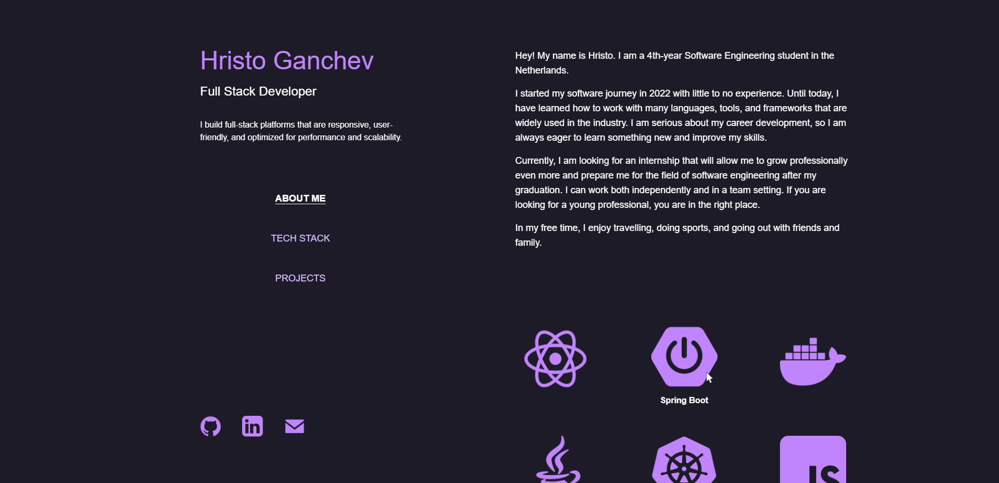

# Hristo Ganchev's Portfolio

A personal portfolio showcasing projects and skills, built with **React (TypeScript)** and deployed on **Netlify**.

[🌐 Visit the live site](https://hristoganchev.dev)



---

## 📑 Table of Contents
- [👤 About Me]
- [💻 Tech Stack]
- [⚙️ Installation]
- [📬 Contact]

---

## 👤 About Me

Hey! My name is **Hristo**. I am a 4th-year Software Engineering student in the Netherlands.

I started my software journey in 2022 with little to no experience. Since then, I have learned many languages, tools, and frameworks widely used in the industry. I am passionate about my career development, always eager to learn new things, and continuously improving my skills.

Currently, I am looking for an internship that will allow me to grow professionally and prepare me for a software engineering career after graduation. I can work both independently and in a team setting.

In my free time, I enjoy **travelling, doing sports, and spending time with friends and family**.

---

## 💻 Tech Stack

- **Frontend:** React, TypeScript
- **Styling:** TailwindCSS
- **Deployment:** Netlify

---

## ⚙️ Installation

To run the project locally:

```bash
git clone https://github.com/TanzerDx/PortfolioV2.git
cd PortfolioV2
npm install
npm start
```

---

## 📬 Contact

- **Website:** [hristoganchev.dev](https://hristoganchev.dev)  
- **Email:** [hristoganchev3@gmail.com](mailto:hristoganchev3@gmail.com)  
- **LinkedIn:** [Hristo Ganchev](https://www.linkedin.com/in/hristo-ganchev-15b3b724b/)

